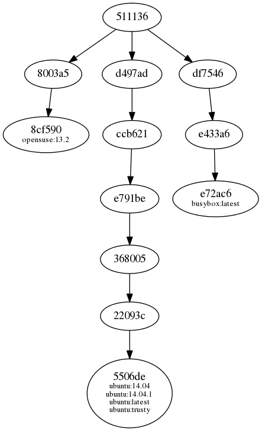
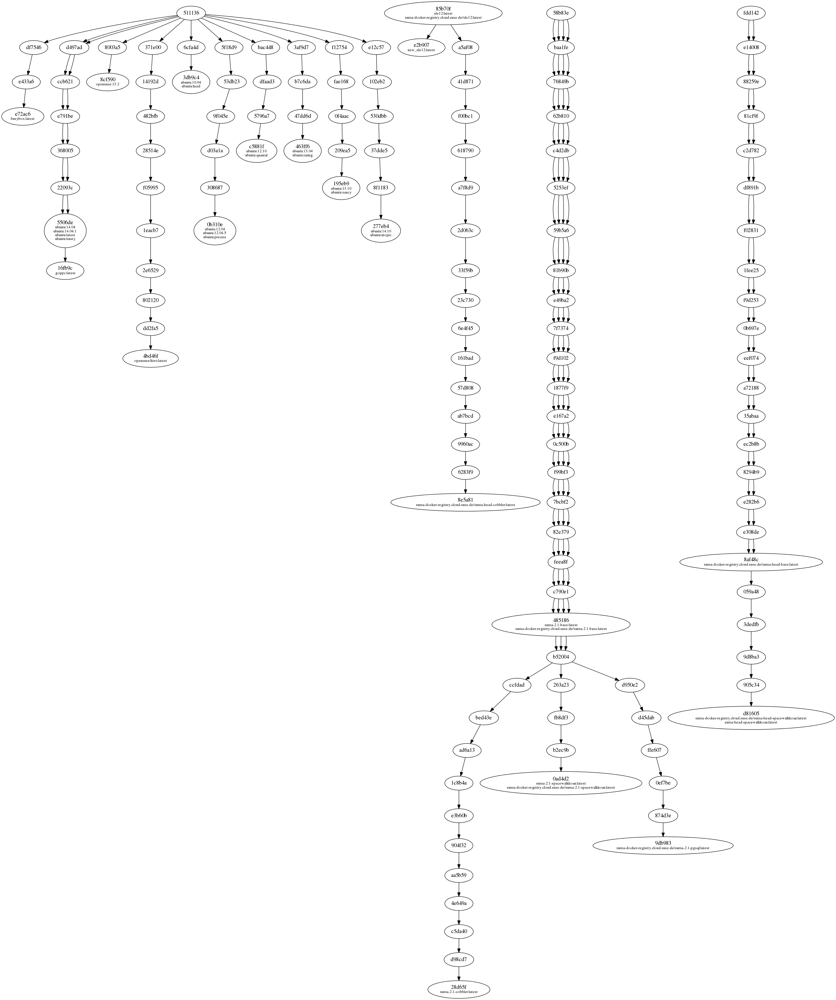

# docker-inspector

This is a simple tool which parses the contents of the directory where the
Docker daemon stores the downloaded images, the containers and all their
metadata. This directory is usually located under `/var/lib/docker` and is
accessible only by the `root` user; hence this tool requires to be run with
administrator rights.

# Installation

docker-inspector is written in ruby. You can install it by using the gem tool:

```
sudo gem install ./docker-inspector-0.1.0.gem
```

The Graphviz tools must be installed on the system.

# Usage


## Images operations

To list the images available on the system just type:

```
sudo inspector images
```

This will produce an output similar to the one of `docker images`.


To obtain more information about a Docker image just type:

```
sudo inspector details image image_name[:tag]
```

For example:
```
sudo inspector details image ubuntu:latest

details image ubuntu:latest
This image is made by 7 layers:
+--------+------------------------------------------------------------------+------------+------------------------------------------------------------+----------------------------------+
| Number | ID                                                               | Size       | Tags                                                       | Created                          |
+--------+------------------------------------------------------------------+------------+------------------------------------------------------------+----------------------------------+
| 1      | 511136ea3c5a64f264b78b5433614aec563103b4d4702f3ba7d4d2698e22c158 | 0.00 B     | -                                                          | 2013-06-13T14:03:50.821769-07:00 |
| 2      | d497ad3926c8997e1e0de74cdd5285489bb2c4acd6db15292e04bbab07047cd0 | 183.59 MiB | -                                                          | 2014-10-21T06:14:16.831736985Z   |
| 3      | ccb62158e97068cc05b2f0927a8acde14c64d0d363cc448238357fe221a39699 | 189.97 kiB | -                                                          | 2014-10-23T23:53:32.692064165Z   |
| 4      | e791be0477f28fd52f7609aed81733427d4cc0da620962d072e18ebcb32720a4 | 0.00 B     | -                                                          | 2014-10-23T23:53:33.805552677Z   |
| 5      | 3680052c0f5cf8ecb86ddf4d6ed331c89cdb691554572a80ec04724cf6ee9436 | 1.85 kiB   | -                                                          | 2014-10-23T23:53:34.208478306Z   |
| 6      | 22093c35d77bb609b9257ffb2640845ec05018e3d96cb939f68d0e19127f1723 | 4.83 MiB   | -                                                          | 2014-10-23T23:53:58.002999398Z   |
| 7      | 5506de2b643be1e6febbf3b8a240760c6843244c41e12aa2f60ccbb7153d17f5 | 0.00 B     | ubuntu:14.04, ubuntu:14.04.1, ubuntu:latest, ubuntu:trusty | 2014-10-23T23:53:59.03271073Z    |
+--------+------------------------------------------------------------------+------------+------------------------------------------------------------+----------------------------------+
```

It is possible to draw the relations between all the Docker images using the
following command:

```
sudo inspector dot [image1] [image2]...
```

You can see the graph of a single image by doing:

```
sudo inspector dot ubuntu:latest
```

Or compare two or more images:
```
sudo inspector dot opensuse:13.2 ubuntu:latest busybox
```



When no image is specified the tool will plot the relations of all the available
images:

```
sudo inspector dot
```




## Operations with layers

To list all the available layers just use:

```
sudo inspector layers

+------------------------------------------------------------------+------------+---------------------------------------------------------------------------------------------------+----------------------------------+
| ID                                                               | Size       | Tags                                                                                              | Created                          |
+------------------------------------------------------------------+------------+---------------------------------------------------------------------------------------------------+----------------------------------+
| e72ac664f4f0c6a061ac4ef332557a70d69b0c624b6add35f1c181ff7fff2287 | 0.00 B     | busybox:latest                                                                                    | 2014-10-01T20:46:08.914288461Z   |
| e433a6c5b276a31aa38bf6eaba9cd1cfd69ea33f706ed72b3f20bafde5cd8644 | 2.32 MiB   | -                                                                                                 | 2014-10-01T20:46:08.684962862Z   |
| df7546f9f060a2268024c8a230d8639878585defcc1bc6f79d2728a13957871b | 0.00 B     | -                                                                                                 | 2014-10-01T20:46:07.263351912Z   |
| 511136ea3c5a64f264b78b5433614aec563103b4d4702f3ba7d4d2698e22c158 | 0.00 B     | -                                                                                                 | 2013-06-13T14:03:50.821769-07:00 |
| 16fb9c1fc5cf615170c77ade24dc3e3269bd3411b9a36ec436aa4ad98bafd13c | 151.50 MiB | goppc:latest                                                                                      | 2014-11-09T15:28:20.681024402Z   |
| 5506de2b643be1e6febbf3b8a240760c6843244c41e12aa2f60ccbb7153d17f5 | 0.00 B     | ubuntu:14.04, ubuntu:14.04.1, ubuntu:latest, ubuntu:trusty                                        | 2014-10-23T23:53:59.03271073Z    |
| 22093c35d77bb609b9257ffb2640845ec05018e3d96cb939f68d0e19127f1723 | 4.83 MiB   | -                                                                                                 | 2014-10-23T23:53:58.002999398Z   |
| 3680052c0f5cf8ecb86ddf4d6ed331c89cdb691554572a80ec04724cf6ee9436 | 1.85 kiB   | -                                                                                                 | 2014-10-23T23:53:34.208478306Z   |
| e791be0477f28fd52f7609aed81733427d4cc0da620962d072e18ebcb32720a4 | 0.00 B     | -                                                                                                 | 2014-10-23T23:53:33.805552677Z   |
| ccb62158e97068cc05b2f0927a8acde14c64d0d363cc448238357fe221a39699 | 189.97 kiB | -                                                                                                 | 2014-10-23T23:53:32.692064165Z   |

[SNIP]

+------------------------------------------------------------------+------------+---------------------------------------------------------------------------------------------------+----------------------------------+
```
## Operations with containers

To list all the containers available on the system (including the ones ran in
the past):

```
sudo inspector containers
```

To have more information about a container:

```
sudo inspector details container <id>
```

